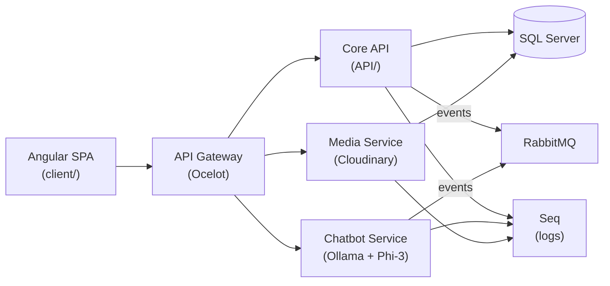

# HalloApp

**Une app de rencontres pensée contre le swipe infini — et un démonstrateur technique complet en microservices .NET 9 / Angular 20.**

[](https://dotnet.microsoft.com/)
[](https://angular.dev/)
[](https://github.com/thoumi/HalloApp/actions/workflows/deploy-api.yml)
[](https://github.com/thoumi/HalloApp/actions/workflows/docs.yml)
[](LICENSE)

📖 [Documentation complète](https://thoumi.github.io/HalloApp/) · 🗺️ [Roadmap](#-roadmap) · 🔒 [Sécurité](#-sécurité--transparence) · 🤝 [Contribuer](CONTRIBUTING.md)

---

## Table des matières

- [Le positionnement](#le-positionnement)
- [Fonctionnalités](#fonctionnalités)
- [Stack technique](#stack-technique)
- [Architecture](#architecture)
- [Démarrage rapide](#démarrage-rapide)
- [Structure du dépôt](#structure-du-dépôt)
- [Documentation](#documentation)
- [Roadmap](#-roadmap)
- [Sécurité & transparence](#-sécurité--transparence)
- [Contribuer](#contribuer)
- [Licence](#licence)
- [À propos](#à-propos)

---

## Le positionnement

La plupart des apps de rencontres optimisent pour le volume : grille infinie,
swipe compulsif, matchs jetables. **HalloApp part de l'hypothèse inverse** :
moins de profils, plus intentionnels — prompts de profil guidés plutôt qu'une
bio en texte libre, une sélection quotidienne curatée plutôt qu'un flux
infini, une intention explicite (« Étincelle ») plutôt qu'un like ambigu.

## Fonctionnalités

| Fonctionnalité | Description |
|---|---|
| 🔐 **Auth JWT + refresh tokens** | Authentification stateless avec rotation de tokens |
| 💬 **Messagerie temps réel** | SignalR (hubs `MessageHub`, `PresenceHub`) |
| 🤖 **Coach de conversation** | Chatbot IA (Ollama + Phi-3) qui suggère des amorces de conversation |
| ❤️ **Matching & likes** | Système de réciprocité, base d'une future entité `Match` indexée |
| 🖼️ **Gestion des médias** | Upload et stockage via Cloudinary |
| 🛠️ **Panel d'administration** | Modération et gestion des utilisateurs |
| 🧩 **Architecture microservices** | API Gateway (Ocelot) + services indépendants |

## Stack technique

| Domaine | Technologies |
|---|---|
| **Frontend** | Angular 20 (standalone components + signals), TypeScript, TailwindCSS |
| **Backend** | ASP.NET Core 9, C#, Entity Framework Core |
| **Base de données** | SQL Server 2022 |
| **Messaging** | RabbitMQ (événements inter-services) |
| **Temps réel** | SignalR (WebSockets) |
| **IA** | Ollama + Phi-3, local, sans dépendance cloud |
| **Observabilité** | Serilog + Seq (logs centralisés) |
| **DevOps** | Docker, Docker Compose, GitHub Actions |

## Architecture



Détail par service, choix techniques et alternatives envisagées :
[docs/architecture/00-OVERVIEW.md](docs/architecture/00-OVERVIEW.md).

## Démarrage rapide

### Avec Docker (recommandé)

```bash
git clone https://github.com/thoumi/HalloApp.git
cd HalloApp
cp .env.example .env   # renseigner les secrets locaux (voir Sécurité ci-dessous)
docker-compose up -d
```

| Service | URL locale |
|---|---|
| API Gateway | http://localhost:5000 |
| Frontend Angular | http://localhost:4200 |
| RabbitMQ Management | http://localhost:15672 |
| Seq (logs) | http://localhost:5341 |

### En développement local (sans Docker)

```bash
# Backend
cd API
dotnet restore
dotnet ef database update
dotnet run

# Frontend
cd client
npm install
npm start

# Chatbot IA (nécessite Ollama installé localement)
ollama run phi3
```

## Structure du dépôt

```
HalloApp/
├── API/                 # Core API — ASP.NET Core 9
├── ApiGateway/           # API Gateway (Ocelot)
├── Services/
│   ├── ChatbotService/   # Coach de conversation (Ollama + Phi-3)
│   └── MediaService/     # Upload et stockage média (Cloudinary)
├── client/               # Frontend Angular 20 (standalone + signals)
├── docs/                 # Documentation technique (voir ci-dessous)
├── portfolio-site/       # Site vitrine personnel — artefact séparé du produit
├── .github/              # Workflows CI/CD, templates issues/PR
├── docker-compose.yml
├── HalloApp.sln
└── mkdocs.yml            # Configuration de la doc publiée sur GitHub Pages
```

## Documentation

La documentation technique complète (architecture détaillée, guides de
migration, dépannage) est publiée sur
**[thoumi.github.io/HalloApp](https://thoumi.github.io/HalloApp/)** et
versionnée sous [`docs/`](docs/) :

| Page | Contenu |
|---|---|
| [Vue d'ensemble architecture](docs/architecture/00-OVERVIEW.md) | Détail des services, flux, choix techniques |
| [Docker Compose](docs/architecture/03-DOCKER-COMPOSE-COMPLETE.md) | Orchestration complète des conteneurs |
| [Guide utilisateur](docs/guide/02-GUIDE-UTILISATEUR.md) | Fonctionnalités côté produit |
| [Migrations techniques](docs/guide/) | Angular 12→20, .NET 8→9, monolithe→microservices |
| [Dépannage WebSocket](docs/TROUBLESHOOTING-WEBSOCKET.md) | Debug SignalR en environnement conteneurisé |
| [ADR](docs/architecture/adr/) | Décisions d'architecture documentées |

## 🗺️ Roadmap

HalloApp suit une feuille de route en 9 phases, chacune démontrant un
ensemble de compétences distinct (Clean Architecture → tests → messagerie
événementielle → sécurité → data → observabilité → industrialisation → IA →
polish). Statut honnête, mis à jour au fil de l'avancement réel :

- [x] **Phase 0 — Blueprint produit** : positionnement, identité de marque, IA remap
- [ ] **Phase 1 — Fondations** (🔄 en cours) : Clean Architecture, SOLID, DDD, API-first — voir [ADR-0001](docs/architecture/adr/0001-clean-architecture-foundations.md) et [audit SOLID](docs/architecture/solid-audit-phase1.md)
- [ ] **Phase 2 — Tests** : xUnit, Testcontainers, Playwright, SonarCloud
- [ ] **Phase 3 — CQRS & événementiel** : MediatR, Outbox pattern réel, Kafka en complément de RabbitMQ
- [ ] **Phase 4 — Sécurité** : OIDC/Entra ID, Key Vault, rate limiting, conformité RGPD
- [ ] **Phase 5 — Data** : Redis (backplane SignalR), MongoDB (historique de chat)
- [ ] **Phase 6 — Observabilité** : OpenTelemetry, Prometheus, Grafana
- [ ] **Phase 7 — Industrialisation** : Kubernetes/AKS, Terraform, Bicep
- [ ] **Phase 8 — IA avancée** : Azure OpenAI, RAG, Semantic Kernel
- [ ] **Phase 9 — Polish** : documentation et storytelling (cette réorganisation en fait partie)

## 🔒 Sécurité & transparence

Ce dépôt assume et documente ses lacunes de sécurité connues plutôt que de
les cacher — c'est délibéré : la Phase 4 de la roadmap existe précisément
pour les corriger, avec le contexte du problème d'abord.

| Constat | Statut |
|---|---|
| `ValidateIssuer` / `ValidateAudience` désactivés sur la validation JWT | Connu — corrigé en Phase 4 |
| Pas de rate limiting sur `/register` et `/login` | Connu — corrigé en Phase 4 |
| Cookie de refresh token en dev (`Secure=false`) | Connu — configuration dev uniquement, durci en Phase 4 |

Détails complets : [SECURITY.md](SECURITY.md).

## Contribuer

Ce dépôt est avant tout un projet personnel de démonstration technique, mais
les retours et suggestions sont bienvenus — voir [CONTRIBUTING.md](CONTRIBUTING.md)
et le [code de conduite](CODE_OF_CONDUCT.md).

## Licence

Tous droits réservés — voir [LICENSE](LICENSE). Le code est visible à des
fins d'évaluation technique (recrutement, revue), mais n'est pas open source :
sa réutilisation, modification ou redistribution nécessite une autorisation
écrite de l'auteur.

## À propos

Projet développé par **Lhoussaine Thoumi** ([portfolio](portfolio-site/))
pour démontrer une expertise full-stack .NET/Angular sur un produit complet :
de l'architecture à la sécurité, en passant par l'IA et l'industrialisation.
