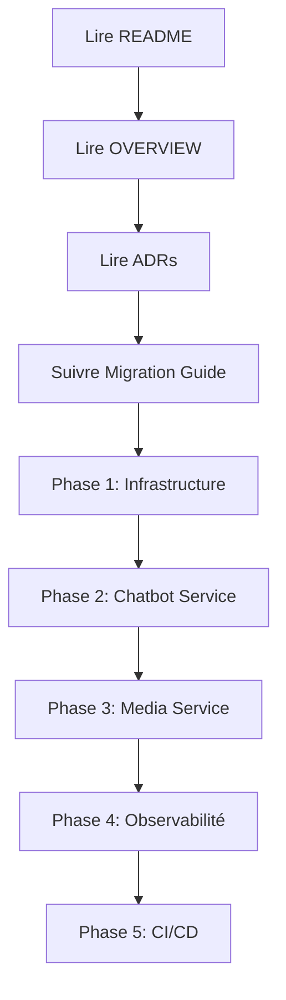

# Migration vers une Architecture Microservices
## CrushApp - Documentation Technique

## Introduction

Ce document constitue le point d'entrée pour la migration partielle de l'application CrushApp vers une architecture microservices.

**Contexte technique** :
- Application actuelle : Monolithe ASP.NET Core 9 avec frontend Angular 20
- Objectif : Migration progressive vers des microservices dans un but d'apprentissage
- Méthodologie : Pattern Strangler Fig (extraction progressive)
- Durée estimée : 6 à 8 semaines (environ 60 à 75 heures de travail)

## Structure de la Documentation

L'ensemble de la documentation technique est organisé dans le répertoire `docs/architecture/`.

### Documents Disponibles

| Document | Description | Durée de lecture |
|----------|-------------|------------------|
| [README.md](architecture/README.md) | Guide d'utilisation de la documentation | 10 minutes |
| [00-OVERVIEW.md](architecture/00-OVERVIEW.md) | Vue d'ensemble de l'architecture | 20 minutes |
| [01-ADR-INDEX.md](architecture/01-ADR-INDEX.md) | Décisions architecturales (ADRs) | 30 minutes |
| [02-MIGRATION-GUIDE.md](architecture/02-MIGRATION-GUIDE.md) | Guide de migration détaillé | 45 minutes |
| [03-DOCKER-COMPOSE-COMPLETE.md](architecture/03-DOCKER-COMPOSE-COMPLETE.md) | Configuration Docker Compose | 25 minutes |
| [04-MONITORING-OBSERVABILITY.md](architecture/04-MONITORING-OBSERVABILITY.md) | Monitoring et observabilité | 35 minutes |
| [05-CI-CD-PIPELINE.md](architecture/05-CI-CD-PIPELINE.md) | Pipelines d'intégration continue | 30 minutes |

Temps total de lecture : environ 3 heures

## Démarrage et Parcours de Lecture

### Ordre de Lecture Recommandé



### Premiers Pas

Pour accéder à la documentation localement :

```powershell
cd docs\architecture
```

Ordre de lecture conseillé :
1. README.md (guide d'utilisation - 10 minutes)
2. 00-OVERVIEW.md (vue d'ensemble - 20 minutes)
3. 01-ADR-INDEX.md (décisions architecturales - 30 minutes)
4. 02-MIGRATION-GUIDE.md (guide pratique - 45 minutes)

---

## Synthèse de l'Architecture Cible

### Approche Progressive (Phase 2)

```
┌─────────────┐
│   Angular   │  ← Frontend inchangé
└──────┬──────┘
       │
┌──────▼──────┐
│ API Gateway │  ← Nouveau (Ocelot)
│  Port 5000  │
└──┬────┬────┬┘
   │    │    │
   ▼    ▼    ▼
┌──────┐ ┌──────┐ ┌──────┐
│Core  │ │Chat- │ │Media │
│API   │ │bot   │ │Svc   │  ← 2 nouveaux microservices
│5001  │ │5002  │ │5003  │
└──┬───┘ └──────┘ └───┬──┘
   │                  │
   └────┬────┬────────┘
        ▼    ▼
    ┌────┐ ┌────┐
    │SQL │ │Rabbit│  ← Infrastructure
    └────┘ └─MQ──┘
```

### Services Créés

| Service | Type | Complexité | Priorité |
|---------|------|------------|----------|
| **Gateway** | Infrastructure | Moyenne | Phase 1 |
| **Chatbot Service** | Microservice | Faible | Phase 2 ⭐ |
| **Media Service** | Microservice | Moyenne | Phase 3 ⭐ |
| **Core API** | Monolith réduit | - | Existant (modifié) |

---

## Compétences Techniques Développées

Ce projet permet d'acquérir une expérience pratique sur :

**Architecture et Patterns** :
- Architecture microservices (patterns, compromis)
- API Gateway (Ocelot/YARP)
- Messaging asynchrone (RabbitMQ, architecture événementielle)

**Infrastructure et DevOps** :
- Docker et Docker Compose (orchestration multi-services)
- Observabilité distribuée (Seq, Serilog, health checks)
- CI/CD (GitHub Actions, déploiements automatisés)

**Technologies .NET et Frontend** :
- .NET 9 (Minimal APIs, optimisations)
- Angular 20 (intégration avec microservices)

Ces compétences sont recherchées sur le marché du travail et permettent d'évoluer vers des postes d'architecte logiciel ou d'ingénieur DevOps.

## Planification du Projet

### Estimation sur 8 Semaines

| Semaine | Phase | Livrables | Heures |
|---------|-------|-----------|--------|
| **1-2** | Préparation + Infrastructure | Gateway, Docker Compose, RabbitMQ | 10-12h |
| **3-4** | Chatbot Service | Microservice AI fonctionnel | 16-20h |
| **5-6** | Media Service | Photos + Events RabbitMQ | 20-24h |
| **7** | Observabilité | Seq, Health Checks, Dashboards | 8-12h |
| **8** | CI/CD | GitHub Actions pipelines | 8-10h |
| **Total** | - | Architecture complète | **62-78h** |

### Jalons de Validation

- [ ] **Jalon 1** : Gateway route vers Core API existant
- [ ] **Jalon 2** : Chatbot Service répond via Gateway
- [ ] **Jalon 3** : Upload photo → Event RabbitMQ → Core API
- [ ] **Jalon 4** : Seq affiche logs de 4+ services
- [ ] **Jalon 5** : CI/CD deploy automatique vers staging

---

## Justification du Projet

### Arguments en Faveur de la Migration

1. **Apprentissage pratique** : La pratique reste le meilleur moyen d'acquérir des compétences
2. **Valorisation du portfolio** : Projet technique démontrable lors d'entretiens
3. **Compétences recherchées** : Les microservices font partie des compétences techniques les plus demandées
4. **Isolation des ressources** : Le service Chatbot peut être déployé avec ses propres ressources CPU/RAM
5. **Flexibilité technologique** : Facilite le remplacement de composants (par exemple changer de modèle LLM)

### Limites de l'Approche

1. **Complexité non justifiée** : Pour un projet de cette taille, un monolithe reste plus adapté
2. **Surcharge opérationnelle** : Gestion de trois services au lieu d'un seul
3. **Latence réseau** : Les appels inter-services introduisent de la latence
4. **Coûts d'infrastructure** : Ressources supplémentaires nécessaires
5. **Complexité du débogage** : Le débogage d'un système distribué est plus difficile

**Synthèse** : Cette migration est pertinente dans un cadre d'apprentissage, mais ne serait pas recommandée en production pour un projet de cette envergure.

## Prérequis Techniques

### Logiciels Nécessaires

```powershell
# Vérifier installations
dotnet --version   # 9.0+
node -v            # 22+
docker --version   # 24+
git --version      # Latest

# Installer si manquant
winget install Microsoft.DotNet.SDK.9
winget install OpenJS.NodeJS
winget install Docker.DockerDesktop
winget install Git.Git
```

### Connaissances Recommandées

| Niveau | Requis | Recommandé |
|--------|--------|------------|
| **Débutant** | C#, ASP.NET Core | Docker basics |
| **Intermédiaire** | REST APIs, Entity Framework | RabbitMQ, Serilog |
| **Avancé** | Microservices theory | Kubernetes, Terraform |

La documentation fournit des explications détaillées adaptées à tous les niveaux.

---

## 📖 Comment Utiliser Cette Documentation

### 1. Lecture Initiale (Jour 1)

```
1. MICROSERVICES-MIGRATION.md (ce fichier) ← Vous êtes ici
2. docs/architecture/README.md
3. docs/architecture/00-OVERVIEW.md
```

**Objectif** : Comprendre vision globale et architecture cible.

### 2. Compréhension Décisions (Jour 2-3)

```
4. docs/architecture/01-ADR-INDEX.md
   - Lire les 8 ADRs
   - Comprendre pourquoi chaque décision
```

**Objectif** : Justifier choix techniques en entretien.

### 3. Implémentation (Semaine 1-8)

```
5. docs/architecture/02-MIGRATION-GUIDE.md
   - Suivre Phase 1 (Infrastructure)
   - Suivre Phase 2 (Chatbot)
   - Suivre Phase 3 (Media)
   - Suivre Phase 4 (Observabilité)
```

**Objectif** : Construire l'architecture étape par étape.

### 4. Opérations (Semaine 7-8)

```
6. docs/architecture/03-DOCKER-COMPOSE-COMPLETE.md
7. docs/architecture/04-MONITORING-OBSERVABILITY.md
8. docs/architecture/05-CI-CD-PIPELINE.md
```

**Objectif** : Production-ready deployment & monitoring.

---

## 🎯 Objectifs Mesurables

### Critères de Succès Technique

- [ ] **3 services** déployés indépendamment
- [ ] **Gateway** route correctement vers tous services
- [ ] **RabbitMQ** transmet events entre services
- [ ] **Seq** centralise logs de tous services
- [ ] **Health checks** tous verts
- [ ] **CI/CD** déploie automatiquement
- [ ] **Tests** coverage > 80%
- [ ] **Documentation** ADRs + README complets

### Critères de Succès Apprentissage

- [ ] Expliquer **trade-offs microservices vs monolithe**
- [ ] Décrire **Strangler Fig Pattern**
- [ ] Justifier **choix Ocelot vs YARP**
- [ ] Implémenter **event-driven communication**
- [ ] Configurer **distributed logging**
- [ ] Créer **CI/CD pipeline** from scratch
- [ ] Présenter architecture en **entretien technique**

---

## 🚨 Pièges à Éviter

### 1. Sur-découpage

❌ **Ne PAS faire** : Extraire Members, Messages, Likes en services séparés  
✅ **Faire** : Garder Core API monolithique pour domaines couplés

### 2. Microservices Distribué Monolithe

❌ **Ne PAS faire** : Services qui s'appellent en chaîne (A→B→C→D)  
✅ **Faire** : Communication async via events RabbitMQ

### 3. Shared Database Anti-Pattern

❌ **Ne PAS faire** : Tous services accèdent même DB avec mêmes tables  
✅ **Faire** : Media Service a sa propre DB, events pour sync

### 4. Ignorer Observabilité

❌ **Ne PAS faire** : Déployer sans logs centralisés  
✅ **Faire** : Seq + Correlation IDs dès le début

### 5. Pas de Rollback Plan

❌ **Ne PAS faire** : Déployer sans pouvoir revenir en arrière  
✅ **Faire** : Garder ancien code avec feature flags pendant transition

---

## 📞 Support & Aide

### Documentation

- **README Principal** : [docs/architecture/README.md](docs/architecture/README.md)
- **FAQ Complète** : Section dans README
- **Troubleshooting** : Dans chaque guide technique

### Communauté

- **GitHub Issues** : [Créer issue](https://github.com/yourusername/datingapp-2025/issues)
- **GitHub Discussions** : [Poser question](https://github.com/yourusername/datingapp-2025/discussions)
- **Pull Requests** : Contributions bienvenues !

### Ressources Externes

- [Microsoft .NET Microservices Guide](https://learn.microsoft.com/en-us/dotnet/architecture/microservices/)
- [Microservices.io Patterns](https://microservices.io/patterns/)
- [Docker Documentation](https://docs.docker.com/)
- [RabbitMQ Tutorials](https://www.rabbitmq.com/tutorials)

---

## 🎓 Prochaines Étapes

### Immédiatement

1. ✅ **Lire ce document** (vous l'avez fait !)
2. 📖 **Ouvrir** [docs/architecture/README.md](docs/architecture/README.md)
3. 🏗️ **Lire** [00-OVERVIEW.md](docs/architecture/00-OVERVIEW.md)
4. 🤔 **Comprendre** [01-ADR-INDEX.md](docs/architecture/01-ADR-INDEX.md)

### Cette Semaine

5. 🚀 **Commencer** [02-MIGRATION-GUIDE.md](docs/architecture/02-MIGRATION-GUIDE.md) Phase 1
6. 🐳 **Setup** Docker Compose + Gateway
7. ✅ **Valider** Jalon 1 (Gateway route vers Core API)

### Ce Mois

8. 🤖 **Implémenter** Chatbot Service (Phase 2)
9. 📸 **Implémenter** Media Service (Phase 3)
10. 📊 **Configurer** Monitoring (Phase 4)

---

## 📝 Conclusion

Tu as maintenant **tout ce qu'il faut** pour migrer vers microservices :

- ✅ **6 documents techniques** complets (200+ pages)
- ✅ **8 Architecture Decision Records** justifiés
- ✅ **Guide migration** étape par étape
- ✅ **Code samples** Docker, .NET, Angular
- ✅ **Checklists validation** à chaque phase
- ✅ **Timeline réaliste** 6-8 semaines

**Rappel Important** : L'objectif est **d'apprendre**, pas de faire du perfect engineering. Expérimente, fais des erreurs, documente ce que tu apprends.

**Cette migration est un investissement** dans tes compétences qui te servira toute ta carrière.

---

## 🚀 Bon courage !

**Prêt à commencer ?**

👉 **Prochaine lecture** : [docs/architecture/README.md](docs/architecture/README.md)

---

**Date** : 2025-01-09  
**Version** : 1.0.0  
**Auteur** : DatingApp Dev Team  
**License** : MIT

**Happy learning! 🎓✨**

