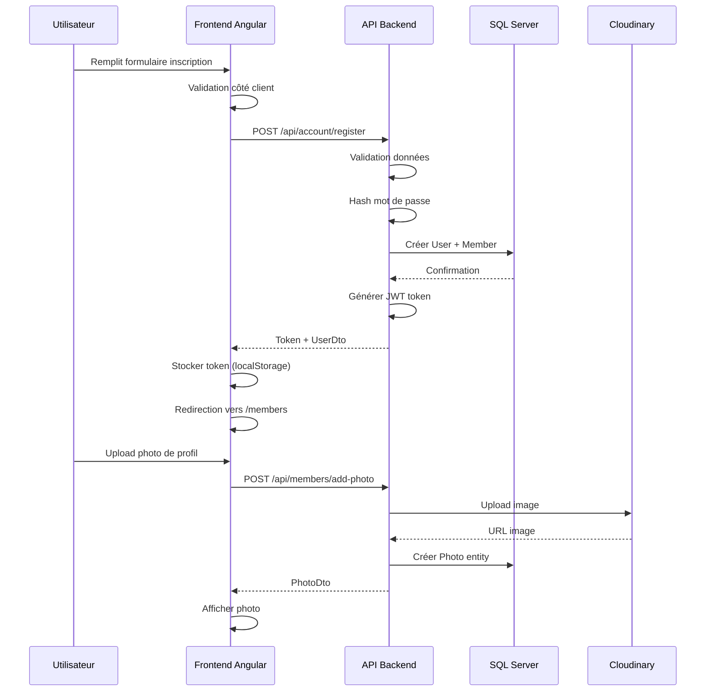
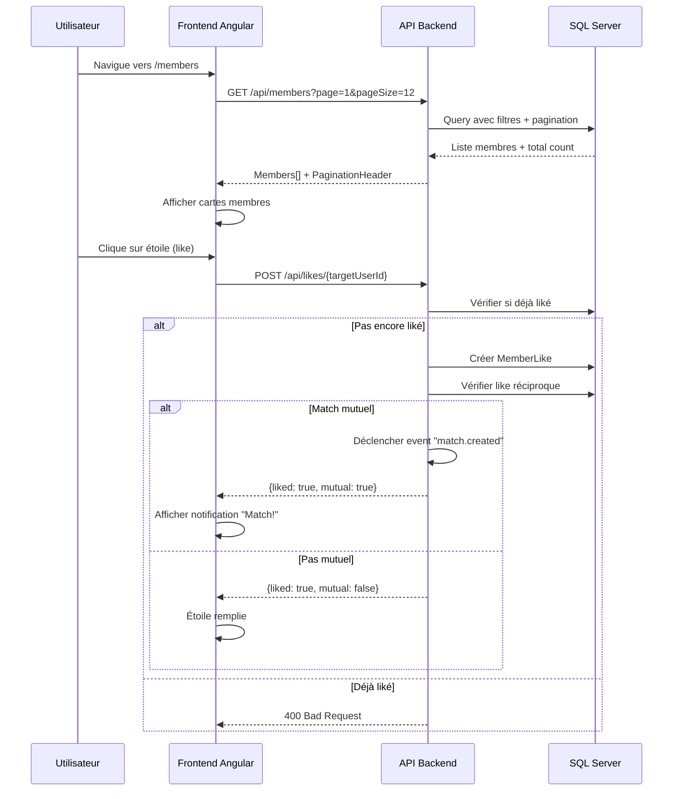
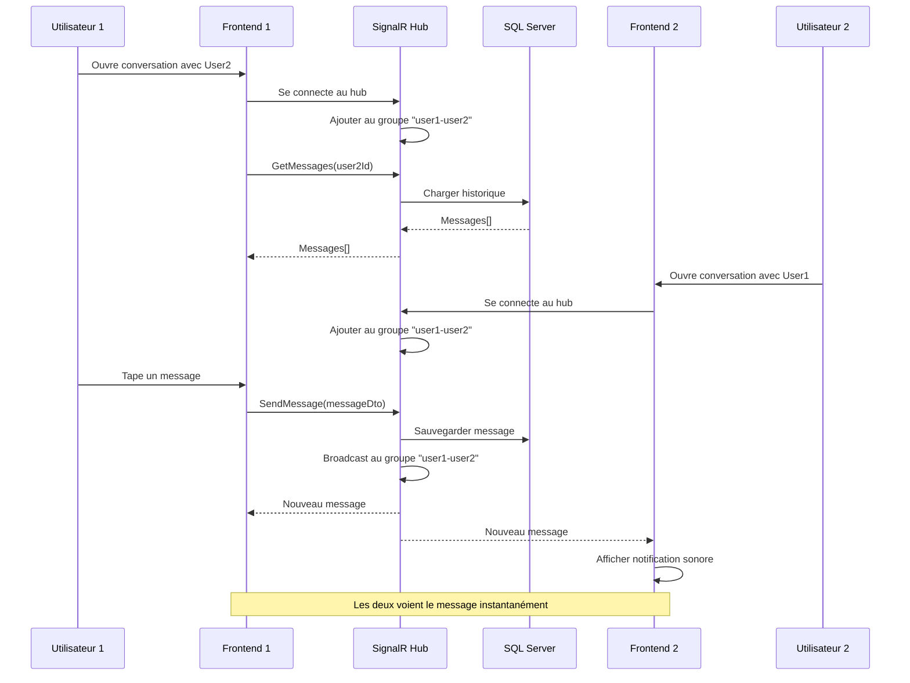
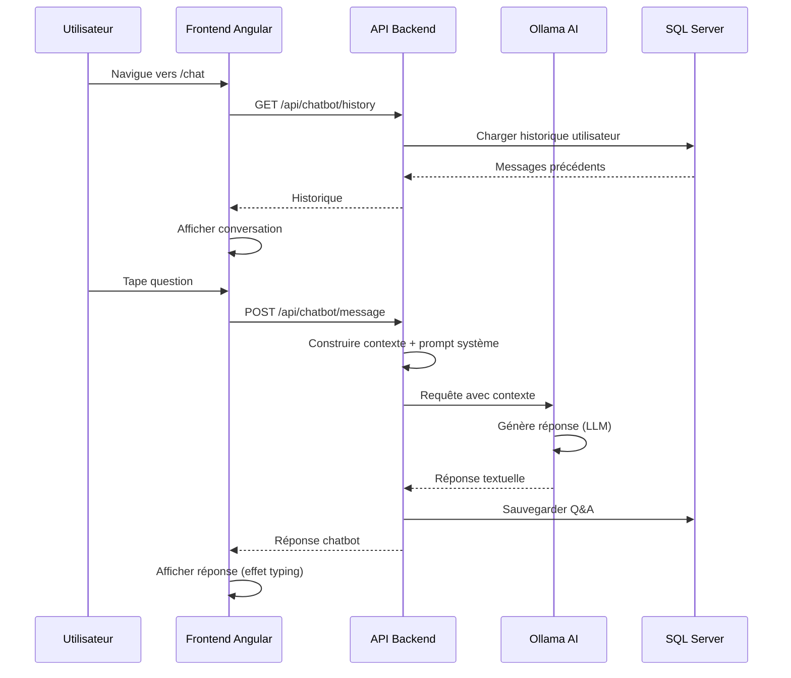
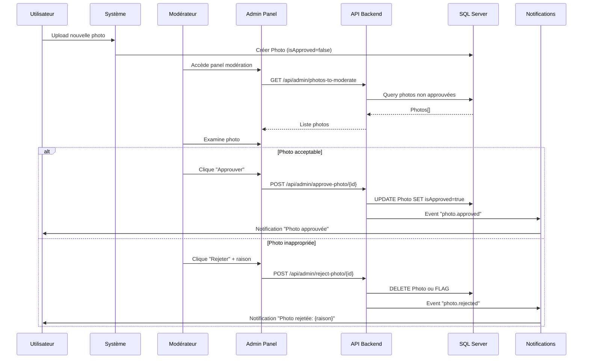

# Guide Fonctionnel - CrushApp

## Présentation de l'Application

---

## 📋 Table des Matières

1. [Vue d'ensemble](#vue-densemble)
2. [Fonctionnalités Principales](#fonctionnalités-principales)
3. [Architecture Fonctionnelle](#architecture-fonctionnelle)
4. [Modules Applicatifs](#modules-applicatifs)
5. [Flux Métier](#flux-métier)
6. [Technologies Utilisées](#technologies-utilisées)

---

## 🎯 Vue d'ensemble

**CrushApp** est une application web moderne de rencontres développée avec ASP.NET Core 9 et Angular 20. Elle permet aux utilisateurs de créer des profils, découvrir d'autres membres, échanger des messages en temps réel et utiliser un chatbot intelligent pour obtenir des conseils.

### Caractéristiques Clés

- ✅ **Application Moderne** : Interface responsive avec TailwindCSS et DaisyUI
- ✅ **Temps Réel** : Messagerie instantanée avec SignalR
- ✅ **Intelligence Artificielle** : Chatbot conversationnel intégré (Ollama)
- ✅ **Multilingue** : Interface disponible en français et anglais
- ✅ **Sécurisée** : Authentification JWT et gestion des rôles
- ✅ **Performante** : Architecture optimisée avec pagination et lazy loading

### Public Cible

- **Utilisateurs Finaux** : Personnes cherchant à faire des rencontres
- **Administrateurs** : Modération du contenu et gestion des utilisateurs
- **Développeurs** : Comprendre l'architecture pour contribution ou maintenance

---

## 🚀 Fonctionnalités Principales

### 1. Authentification et Profils Utilisateurs

#### Inscription et Connexion
- **Inscription rapide** avec validation email
- **Connexion sécurisée** via JWT (JSON Web Tokens)
- **Refresh tokens** pour sessions persistantes
- **Gestion de rôles** : utilisateur standard, modérateur, administrateur

#### Gestion de Profil
- **Informations personnelles** :
  - Nom d'affichage
  - Date de naissance (calcul automatique de l'âge)
  - Genre
  - Ville et pays
  - Description personnelle
- **Photo de profil** avec upload vers Cloudinary
- **Galerie photos** (multiple photos par profil)
- **Modification en temps réel** avec garde de navigation (prévient la perte de données)

### 2. Découverte de Membres

#### Liste des Membres
- **Affichage en grille** avec cartes visuelles
- **Pagination intelligente** pour performances optimales
- **Filtres avancés** :
  - Âge (minimum et maximum)
  - Genre
  - Localisation (ville/pays)
  - Dernière activité
- **Tri personnalisable** :
  - Membres récents
  - Plus actifs
  - Dernière connexion

#### Profil Détaillé
Navigation par onglets :
- **📋 Profil** : Informations complètes et modification
- **📸 Photos** : Galerie avec possibilité d'upload et suppression
- **💬 Messages** : Conversation directe avec le membre

### 3. Système de Likes et Matching

#### Fonctionnalité "Like"
- **Bouton étoile** sur chaque carte de membre
- **Liste de favoris** accessible via l'onglet "Lists"
- **Filtres** :
  - Membres que vous avez likés
  - Membres qui vous ont liké
  - Matches mutuels (crush réciproque)

#### Algorithme de Matching
- Détection automatique des likes réciproques
- Notification visuelle des matches
- Suggestions basées sur les préférences

### 4. Messagerie en Temps Réel

#### Conversations Privées
- **Messagerie instantanée** avec SignalR
- **Indicateur de présence** (en ligne / hors ligne)
- **Indicateur de frappe** ("est en train d'écrire...")
- **Historique complet** des conversations
- **Timestamps** avec affichage "il y a X minutes"
- **Marquage automatique comme lu**

#### Interface Messages
- **Liste des conversations** avec derniers messages
- **Compteur de messages non lus**
- **Filtres** : tous / non lus / récents
- **Recherche** dans les conversations

### 5. Chatbot IA Conversationnel

#### Assistant Intelligent
- **Modèle IA locale** (Ollama) pour confidentialité
- **Conseils personnalisés** sur :
  - Comment créer un profil attractif
  - Conseils de communication
  - Suggestions de messages d'accroche
  - Aide générale sur l'utilisation de l'app
- **Contexte de conversation** maintenu par session
- **Réponses naturelles** et empathiques

### 6. Administration et Modération

#### Panel Administrateur
Accessible uniquement aux administrateurs et modérateurs :

##### Gestion des Utilisateurs
- **Liste complète** des membres
- **Modification des rôles** :
  - Attribution/retrait du rôle Modérateur
  - Attribution/retrait du rôle Administrateur
- **Désactivation/bannissement** de comptes
- **Statistiques utilisateurs** :
  - Nombre total de membres
  - Nouveaux inscrits (jour/semaine/mois)
  - Utilisateurs actifs

##### Modération des Photos
- **Queue de modération** pour nouvelles photos
- **Approbation/rejet** avec raison
- **Système de flag** pour contenu inapproprié
- **Historique de modération**

---

## 🏗️ Architecture Fonctionnelle

### Architecture de l'Application

L'application CrushApp suit une architecture en couches avec les composants suivants :

- **Interface Web Angular** : Frontend moderne avec composants standalone
- **API Backend ASP.NET** : Services REST et SignalR pour le temps réel
- **Chatbot IA** : Service d'assistance utilisant Ollama + Phi-3
- **Services Externes** : Cloudinary pour les images, SQL Server pour les données

### Architecture en Couches

| Couche | Responsabilité | Technologies |
|--------|---------------|--------------|
| **Présentation** | Interface utilisateur, routing, state management | Angular 20, TailwindCSS, DaisyUI |
| **Application** | Logique métier, orchestration | ASP.NET Core 9 Controllers |
| **Domaine** | Entités, règles métier | C# 13, Entity Framework Core |
| **Infrastructure** | Accès données, services externes | SQL Server, Cloudinary, SignalR |

---

## 📦 Modules Applicatifs

### Module Authentication (`AccountController`)

**Endpoints** :
- `POST /api/account/register` - Inscription nouvel utilisateur
- `POST /api/account/login` - Connexion
- `POST /api/account/refresh-token` - Renouvellement du token
- `GET /api/account/current-user` - Obtenir l'utilisateur connecté

**Fonctionnalités** :
- Validation des données (email, mot de passe fort)
- Hashing sécurisé des mots de passe (Identity)
- Génération de tokens JWT
- Gestion des refresh tokens

### Module Members (`MembersController`)

**Endpoints** :
- `GET /api/members` - Liste paginée des membres (avec filtres)
- `GET /api/members/{id}` - Détails d'un membre
- `PUT /api/members` - Mise à jour profil utilisateur
- `POST /api/members/add-photo` - Upload photo
- `DELETE /api/members/delete-photo/{photoId}` - Suppression photo
- `PUT /api/members/set-main-photo/{photoId}` - Définir photo principale

**Fonctionnalités** :
- Pagination avec `PaginationHeader` custom
- Filtres avancés (âge, genre, localisation)
- Upload vers Cloudinary avec optimisation
- Calcul automatique de l'âge depuis DateOfBirth
- Mise à jour de `LastActive` automatique (middleware)

### Module Likes (`LikesController`)

**Endpoints** :
- `POST /api/likes/{targetUserId}` - Liker un membre
- `DELETE /api/likes/{targetUserId}` - Retirer un like
- `GET /api/likes` - Liste des likes (avec filtres)
- `GET /api/likes/mutual` - Liste des matches mutuels

**Fonctionnalités** :
- Détection de likes réciproques
- Prévention de double like
- Filtres : liked / likedBy / mutual

### Module Messages (`MessagesController` + `MessageHub`)

**Endpoints REST** :
- `GET /api/messages` - Liste des conversations
- `GET /api/messages/thread/{recipientId}` - Fil de conversation
- `POST /api/messages` - Envoyer un message
- `DELETE /api/messages/{id}` - Supprimer un message

**SignalR Hub** :
- `SendMessage(CreateMessageDto)` - Envoi temps réel
- `DeleteMessage(messageId)` - Suppression temps réel
- Gestion des groupes par conversation
- Broadcast automatique aux participants

**Fonctionnalités** :
- Indicateur "en train d'écrire"
- Marquage automatique comme lu quand conversation ouverte
- Soft delete des messages
- Timestamps précis

### Module Chatbot (`ChatbotController`)

**Endpoints** :
- `POST /api/chatbot/message` - Envoyer message au chatbot
- `GET /api/chatbot/history` - Historique conversation
- `DELETE /api/chatbot/history` - Réinitialiser contexte

**Fonctionnalités** :
- Intégration avec Ollama (modèle local)
- Context management par utilisateur
- Prompts système personnalisés
- Réponses streaming (optionnel)

### Module Admin (`AdminController`)

**Endpoints** :
- `GET /api/admin/users-with-roles` - Liste utilisateurs avec rôles
- `POST /api/admin/edit-roles/{username}` - Modifier les rôles
- `GET /api/admin/photos-to-moderate` - Photos en attente de modération
- `POST /api/admin/approve-photo/{photoId}` - Approuver photo
- `POST /api/admin/reject-photo/{photoId}` - Rejeter photo

**Fonctionnalités** :
- Autorisation basée sur les rôles (Policy "RequireAdminRole")
- Audit trail des actions admin
- Statistiques en temps réel

---

## 🔄 Flux Métier Principaux

### Flux 1 : Inscription d'un Nouvel Utilisateur



### Flux 2 : Découverte et Like d'un Membre



### Flux 3 : Conversation en Temps Réel



### Flux 4 : Utilisation du Chatbot



### Flux 5 : Modération de Photo (Admin)



---

## 💻 Technologies Utilisées

### Frontend

| Technologie | Version | Usage |
|------------|---------|-------|
| **Angular** | 20.3.2 | Framework SPA |
| **TypeScript** | 5.8.2 | Langage principal |
| **TailwindCSS** | 4.1.7 | Framework CSS utility-first |
| **DaisyUI** | 5.0.37 | Composants UI pré-stylés |
| **SignalR Client** | 8.0.7 | WebSockets temps réel |
| **RxJS** | 7.8.0 | Programmation réactive |

**Patterns Frontend** :
- Standalone Components (Angular moderne)
- Signals pour state management
- Guards pour protection des routes
- Interceptors pour JWT et erreurs
- Pipes personnalisés (age, timeAgo, translate)
- Services injectables avec `providedIn: 'root'`

### Backend

| Technologie | Version | Usage |
|------------|---------|-------|
| **ASP.NET Core** | 9.0 | Framework web API |
| **C#** | 13 | Langage principal |
| **Entity Framework Core** | 9.0 | ORM pour accès données |
| **ASP.NET Identity** | 9.0 | Authentification et autorisation |
| **SignalR** | 9.0 | Communication temps réel |
| **SQL Server** | 2022 | Base de données |

**Patterns Backend** :
- Repository Pattern pour accès données
- Unit of Work pour transactions
- DTOs pour sérialisation
- Middleware pour logging et exceptions
- Dependency Injection natif
- Action Filters pour logging d'activité

### Services Externes

- **Cloudinary** : Stockage et optimisation d'images
- **Ollama** : Modèle LLM local (phi3, llama3, mistral, etc.)
- **JWT** : Authentification stateless

---

## 🎨 Interface Utilisateur

### Design System

**Palette de Couleurs (DaisyUI)** :
- **Primary** : Indigo (#4F46E5)
- **Secondary** : Purple (#9333EA)
- **Accent** : Pink (#EC4899)
- **Success** : Green (#10B981)
- **Warning** : Amber (#F59E0B)
- **Error** : Red (#EF4444)

**Thèmes** :
- Mode clair (par défaut)
- Mode sombre (bascule automatique)

### Composants Réutilisables

| Composant | Usage |
|-----------|-------|
| `TextInput` | Champs de formulaire standardisés avec validation |
| `ImageUpload` | Upload drag-and-drop avec preview |
| `Paginator` | Pagination avec navigation |
| `ConfirmDialog` | Modale de confirmation d'actions |
| `DeleteButton` | Bouton avec confirmation intégrée |
| `StarButton` | Bouton like avec animation |
| `LanguageSelector` | Sélecteur français/anglais |

### Responsive Design

- **Mobile First** : Optimisé pour smartphones
- **Breakpoints TailwindCSS** :
  - sm: 640px
  - md: 768px
  - lg: 1024px
  - xl: 1280px
- **Navigation adaptative** : Menu hamburger sur mobile

---

## 🔒 Sécurité

### Authentification et Autorisation

1. **JWT Tokens** :
   - Access token (15 minutes de durée de vie)
   - Refresh token (7 jours)
   - Stockage sécurisé (HttpOnly cookies recommandé en prod)

2. **Rôles et Policies** :
   ```csharp
   [Authorize(Policy = "RequireAdminRole")]  // Admin seulement
   [Authorize(Policy = "ModeratePhotoRole")] // Admin ou Modérateur
   [Authorize]                               // Utilisateur connecté
   ```

3. **Protection CORS** :
   - Whitelist des origines autorisées
   - Credentials autorisées pour SignalR

### Validation des Données

**Côté Frontend** :
- Validation réactive avec Angular Forms
- Messages d'erreur localisés
- Prévention de double soumission

**Côté Backend** :
- Data Annotations sur DTOs
- Validation ModelState
- Sanitisation des inputs

### Sécurité des Photos

- **Modération obligatoire** avant affichage public
- **Limitations** :
  - Taille max : 10 MB
  - Formats acceptés : JPG, PNG, GIF, WEBP
  - Dimensions max : 4000x4000 px
- **Cloudinary Transformations** :
  - Redimensionnement automatique
  - Optimisation qualité/poids
  - Suppression métadonnées EXIF

---

## 📊 Métriques et KPIs

### Métriques Utilisateur

- **Taux d'inscription** : Conversions visiteur → membre
- **Engagement** :
  - Likes envoyés par utilisateur
  - Messages envoyés par jour
  - Temps moyen de session
- **Rétention** :
  - Utilisateurs actifs quotidiens (DAU)
  - Utilisateurs actifs mensuels (MAU)
  - Taux de retour (jour 1, jour 7, jour 30)

### Métriques Techniques

- **Performance** :
  - Temps de réponse API (< 200ms P95)
  - Time to First Byte (TTFB)
  - Largest Contentful Paint (LCP)
- **Disponibilité** :
  - Uptime (> 99.9%)
  - Taux d'erreur (< 0.1%)

### Métriques Chatbot

- **Utilisation** :
  - Nombre de messages par utilisateur
  - Sessions chatbot par jour
- **Qualité** :
  - Taux de satisfaction (feedback utilisateur)
  - Temps de réponse Ollama

---

## 🚀 Évolutions Futures

### Fonctionnalités Prévues

1. **Système de Matchmaking Avancé** :
   - Algorithme basé sur affinités
   - Suggestions personnalisées
   - Score de compatibilité

2. **Appels Vidéo** :
   - Intégration WebRTC
   - Appels 1-to-1 sécurisés
   - Filtres vidéo (optionnel)

3. **Gamification** :
   - Badges et achievements
   - Système de points
   - Leaderboards

4. **Notifications Push** :
   - Notifications navigateur (Web Push)
   - Notifications mobiles (PWA)
   - Préférences personnalisables

5. **Analytics Avancées** :
   - Dashboard utilisateur (profil vu X fois)
   - Insights sur les likes
   - Statistiques de messages

### Améliorations Techniques

- **Performance** :
  - Lazy loading des images
  - Service Worker pour cache
  - Server-Side Rendering (SSR)

- **Accessibilité** :
  - Conformité WCAG 2.1 AA
  - Navigation clavier complète
  - Support lecteurs d'écran

- **SEO** :
  - Meta tags dynamiques
  - Sitemap XML
  - Structured data (Schema.org)

---

## 📞 Support et Ressources

### Documentation Complémentaire

- [Guide Utilisateur](02-GUIDE-UTILISATEUR.md) : Mode d'emploi détaillé
- [Migration Angular 12 → 20](03-MIGRATION-ANGULAR.md) : Retour d'expérience
- [Architecture Microservices](../architecture/00-OVERVIEW.md) : Architecture technique

### Liens Utiles

- **Repository GitHub** : [github.com/thoumi/CrushApp2025](https://github.com/thoumi/CrushApp2025)
- **Documentation en ligne** : [thoumi.github.io/CrushApp2025](https://thoumi.github.io/CrushApp2025)

---

**Version** : 1.0.0  
**Dernière mise à jour** : Octobre 2025

