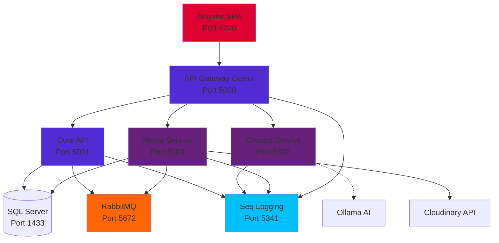
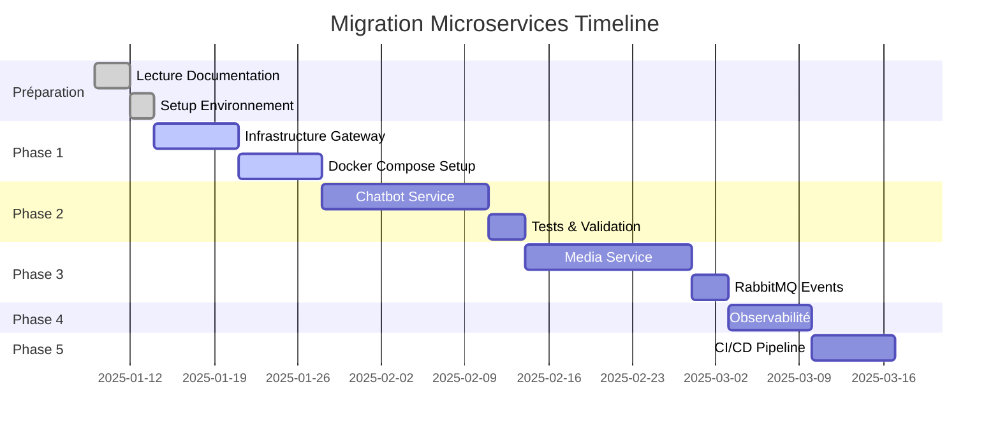

# CrushApp - Migration Partielle vers Microservices

## Application Monolithe Migrée Partiellement en Architecture Microservices

Ce projet documente la migration progressive d'une application monolithique de rencontres (CrushApp) développée en ASP.NET Core 9 et Angular 20 vers une architecture microservices.

**Type de migration** : Partielle et progressive  
**Architecture initiale** : Monolithe ASP.NET Core 9 + Angular 20  
**Architecture cible** : Hybride (Core monolithique + 2 microservices extraits)

**Objectifs** :
- Monter en compétences sur les architectures distribuées
- Isoler les services à forte consommation de ressources (Chatbot AI)
- Faciliter l'évolution technologique de certains composants

**Méthodologie** : Pattern Strangler Fig (extraction progressive sans réécriture complète)  
**Durée du projet** : 6 à 8 semaines (60-75 heures)  
**Stack technique** : .NET 9, Angular 20, Docker Compose, RabbitMQ, Seq, Ocelot

## Démarrage Rapide

### Parcours selon votre profil

**Si vous débutez avec les microservices** :

1. Commencez par lire l'[Introduction générale](MICROSERVICES-MIGRATION.md) (environ 10 minutes)
2. Consultez la [Vue d'ensemble de l'architecture](architecture/00-OVERVIEW.md) (20 minutes)
3. Découvrez les [décisions architecturales (ADRs)](architecture/01-ADR-INDEX.md) pour comprendre les choix effectués (30 minutes)
4. Suivez le [Guide de migration](architecture/02-MIGRATION-GUIDE.md) étape par étape

**Si vous avez de l'expérience** :

- Consultez directement l'[architecture cible](architecture/00-OVERVIEW.md#architecture-cible-phase-2)
- Allez à la [configuration Docker Compose](architecture/03-DOCKER-COMPOSE-COMPLETE.md)
- Explorez le [monitoring et l'observabilité](architecture/04-MONITORING-OBSERVABILITY.md)
- Examinez les [pipelines CI/CD](architecture/05-CI-CD-PIPELINE.md)

**Pour une mise en place rapide** :

```bash
git clone https://github.com/yourusername/datingapp-2025.git
cd datingapp-2025
docker-compose up -d
```

Puis vérifiez l'état des services sur http://localhost:5000/healthchecks-ui

## Organisation de la Documentation

La documentation est organisée en plusieurs sections principales :

| Section | Description | Temps de lecture estimé |
|---------|-------------|-------------------------|
| [Introduction](MICROSERVICES-MIGRATION.md) | Présentation générale du projet | 10 minutes |
| [Architecture](architecture/00-OVERVIEW.md) | Vue d'ensemble et stratégie | 20 minutes |
| [Décisions architecturales](architecture/01-ADR-INDEX.md) | 8 ADRs documentant les choix techniques | 30 minutes |
| [Guide de migration](architecture/02-MIGRATION-GUIDE.md) | Guide détaillé en 5 phases | 45 minutes |
| [Configuration Docker](architecture/03-DOCKER-COMPOSE-COMPLETE.md) | Orchestration multi-services | 25 minutes |
| [Monitoring](architecture/04-MONITORING-OBSERVABILITY.md) | Logs, métriques et traces | 35 minutes |
| [CI/CD](architecture/05-CI-CD-PIPELINE.md) | Pipelines de déploiement | 30 minutes |

Temps total de lecture : environ 3 heures

## Architecture Technique

### Vue d'ensemble de l'architecture cible



### Description des services

**Microservices extraits** :

- **Chatbot Service** : Service d'IA conversationnelle utilisant Ollama
- **Media Service** : Gestion des photos, intégration Cloudinary et système de modération

**Core Monolith** :

- **Core API** : Authentification, gestion des membres, messagerie et système de likes. Ces fonctionnalités restent dans un monolithe car elles sont fortement couplées.

**Infrastructure** :

- **API Gateway** : Ocelot pour le routing et l'authentification
- **RabbitMQ** : Message broker pour la communication asynchrone entre services
- **Seq** : Centralisation des logs applicatifs

## Compétences Développées

Ce projet permet de se familiariser avec plusieurs technologies et concepts :

**Architecture et Patterns** :

- Patterns microservices en environnement .NET
- Migration progressive (Strangler Fig)
- Architecture orientée événements
- Domain-Driven Design et Bounded Contexts

**Infrastructure et Déploiement** :

- Docker et Docker Compose
- Orchestration de conteneurs
- Gestion des réseaux et volumes
- Déploiement multi-services

**APIs et Communication** :

- API Gateway avec Ocelot
- APIs REST en .NET 9
- Messaging asynchrone avec RabbitMQ
- Communication temps réel avec SignalR

**Monitoring et Observabilité** :

- Centralisation des logs avec Seq
- Distributed tracing
- Health checks
- Métriques avec Prometheus et Grafana (optionnel)

## Planification du Projet

### Timeline sur 8 semaines



| Phase | Durée | Heures | Livrables |
|-------|-------|--------|-----------|
| **Préparation** | 1 semaine | 8-10h | Docs lues, environnement setup |
| **Infrastructure** | 2 semaines | 10-12h | Gateway, Docker Compose, RabbitMQ |
| **Chatbot Service** | 2 semaines | 16-20h | Microservice AI fonctionnel |
| **Media Service** | 2 semaines | 20-24h | Photos + Events RabbitMQ |
| **Observabilité** | 1 semaine | 8-12h | Seq, Health Checks, Dashboards |
| **CI/CD** | 1 semaine | 8-10h | GitHub Actions pipelines |
| **Total** | **8-10 semaines** | **62-78h** | Architecture complète |

## Contexte et Justification

### Pourquoi migrer vers les microservices ?

**Dans un contexte d'apprentissage** :

- Développer des compétences recherchées sur le marché du travail
- Constituer un projet technique démontrable pour un portfolio
- Acquérir une expérience pratique sur les architectures distribuées
- Isoler les ressources du service Chatbot (consommateur en CPU/RAM)
- Faciliter l'évolution technologique (changement de modèle LLM par exemple)

**Limites dans un contexte de production** :

- Complexité accrue pour un projet de cette taille
- Surcharge opérationnelle (maintenance de plusieurs services)
- Latence introduite par les communications réseau
- Coûts d'infrastructure supplémentaires
- Débogage plus difficile dans un système distribué

**Conclusion** : Cette migration est pertinente dans une optique d'apprentissage et de montée en compétences, mais ne serait pas nécessairement justifiée pour un projet de cette envergure en production (sauf besoins spécifiques de scalabilité).

## Prochaines Étapes

Pour commencer votre migration :

1. Lisez l'[introduction générale](MICROSERVICES-MIGRATION.md) (10 minutes)
2. Consultez la [vue d'ensemble de l'architecture](architecture/00-OVERVIEW.md) (20 minutes)
3. Explorez les [décisions architecturales](architecture/01-ADR-INDEX.md) (30 minutes)
4. Suivez le [guide de migration phase 1](architecture/02-MIGRATION-GUIDE.md)

## Ressources et Support

**Documentation** :
- Utilisez la barre de recherche en haut pour trouver rapidement une information
- La navigation latérale permet d'accéder à toutes les sections

**Liens utiles** :
- [Guide Microsoft sur les microservices .NET](https://learn.microsoft.com/en-us/dotnet/architecture/microservices/)
- [Patterns pour microservices](https://microservices.io/patterns/)
- [Documentation Docker](https://docs.docker.com/)
- [Tutoriels RabbitMQ](https://www.rabbitmq.com/tutorials)

---

*Documentation mise à jour le 9 janvier 2025 - Version 1.0.0*

